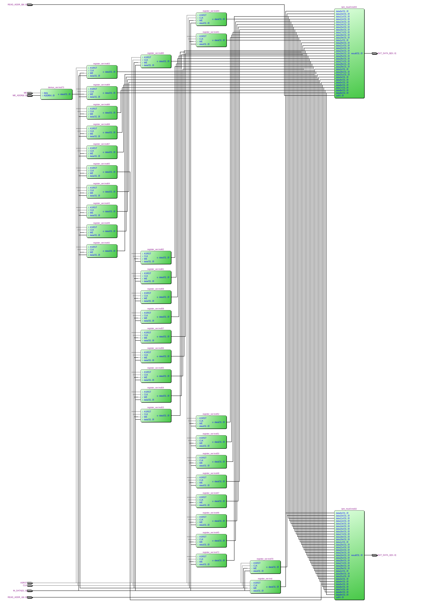
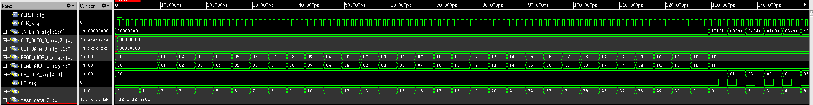

=============================================
Лабораторна робота №2
=============================================

Тема
------

Створення та верифікація регістрового файлу ядра MIPS

Хід роботи
-------

Після перегляду ТЗ вимоги до дизайну були прийняті наступні:

Розрядність регістрів -- 32 біти
Кількість регістрів -- 32
Вхід асинхронного скидання
Вхід дозволу запису
Один вхід адреси запису та даних на запис
Два входи адреси читання та два виходи даних, що зчитуються

Проект було вирішено створювати комбінаційним методом, тобто деякі його частини реалізувати на Verilog, а деякі
за допомогоу редактора схем, що у деякій мірі спростило виконання завдання та допомогло виконати його швидше. Проект складаєтья з 32 32бітних регістрів(які
були реалізовані у попередній лабораторній роботі) для безпосередньо зберігання даних, 2 мультиплексорів для зчитування даних з регістрів та 1 демультиплексора
за допомогою якого відбувається запис даних до регістру.

Після цього було написано реалізацію цього самого регістра на Verilog, що зайняло набагато менше часу. 
Ця реалізація запрацювала з тим самим, але оптимізованим(змінено назви пінів) тестбенчем відразу і без помилок.

Так виглядає RTL схема цього регістрового файлу

Так виглядає частина Waveform симуляції

Висновки
-------

Під час виконання лабораторної роботи  були здобутті деякі знання мови Verilog, навчився розбивати створювані реалізації на модулі та параметризувати їх.

P.S.За основу був взят протокол О.Шліхти

