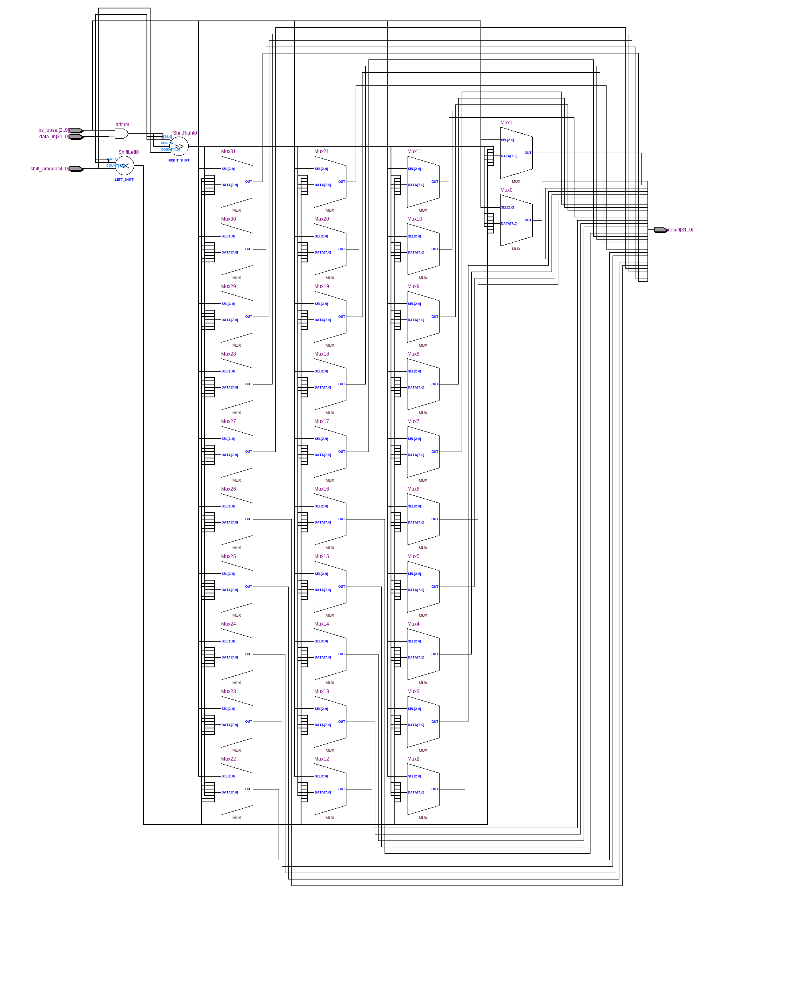
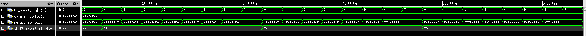

=============================================
Лабораторна робота №3
=============================================

Тема
------

Створення та верифікація пристрою швидкого зсуву

Хід роботи
-------

Пристрій має виконувати такі зсуви
	- Логічний зсув вліво
	- Логічний зсув вправо
	- Арифметичний зсув вправо
	- Циклічний зсув вправо
	- Циклічний зсув вліво

Проект було вирішено створювати на мові Verilog,для економії часу , ніж створювати схему 
у схемному редакторі. Пристрій складається з двох елементів зсуву, елементу "AND" та шинного мульитплексора, який комутує вихід пристрою
з потрібним елементом зсуву. Також було створено тестбенч на мові Verilog, що допомогло віддебажити пристрій.

Т

Так виглядає RTL схема цього регістрового файлу

Так виглядає частина Waveform симуляцыъ

Висновки
-------

В ході виконання лабораторної роботи були покращені знання володіння мовою Verilog. А також було здобуто знання зі створення та верифікації пристрою швидкого зсуву.
P.S. За основу був взятий протокол О.Шліхти

