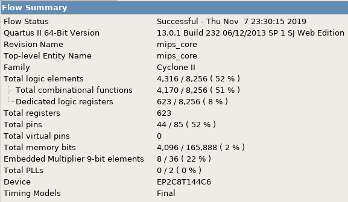

=============================================
Лабораторна робота №9
=============================================

Тема
------

Додавання кеш-пам'яті до саморобного RISC ядра

Хід роботи
-------

 
	Завданням було прикрутити до конвеєрного ядра з 8 лаби кеш даних як посередник між пам'яттю даних та процесором. Тип кешу не задавався, тому я вирішив 
зробити fully associative кеш.
* 
	Проект було вирішено створювати на мові Verilog, тому що це зайняло набагато менше часу, ніж створення схеми
у схемному редакторі. Для спрощення роботи над пристроєм мною було вирішено кожен блок створити в окремому файлі, що дуже сильно спростило збирання та
відладку пристрою. Потім мною було написано тестовий файл на мові Verilog, що допомогло відладити пристрій.

	Кеш однослівний. Причиною обрання саме його було те, що однослівний кеш просто створити. Структурно кеш можна поділити на 4 колонки:
	- Дані
	- Тег(позиція даних у DRAM)
	- Біт валідності
	- Лічильник(для реалізації алгоритму витіснення FIFO)
Для перевірки працездатності використав код з 5-6 лабораторної роботи. У даному випадку, через те, що DRAM і КЕШ мають дуже маленькі розміри і розташовані на
одному кристалі, відчутних затримок при влучанні та промаху немає, також через згадані раніше причини моєму кешу немає потреби зупиняти конвеєр при промаху, це
лише дуже сильно заважало.

.. image:: media/RTL.png
Так виглядає RTL схема GPIO модуля

Використані ресурси(можна оптимізувати)

Максимальна частота

Висновки
-------

	Під час виконання лабораторної роботи я прикрутив до конвеєрного RISC ядра кеш-контролер, що зберігав у собі часто використовувані дані з основної пам'яті. Такий контролер можна використовувати для будь-яких типів пам'яті, які можна підключити як зовнішні модулі. кеш асоціативний, що дає надає оптимальне співвідношення між
	кількістю запитів та промахів.

	P.S. За основу звіту було взято звіт О.Шліхти.